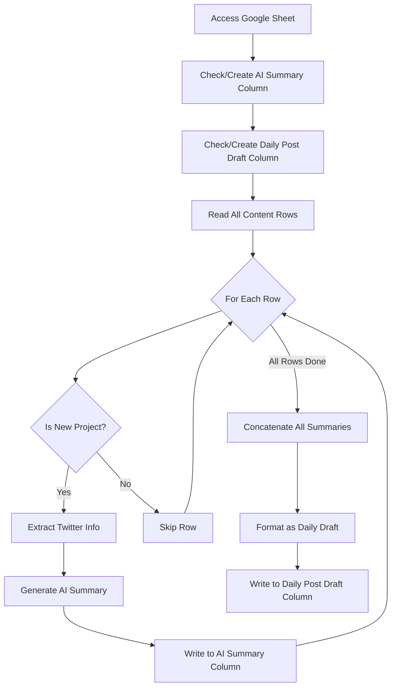
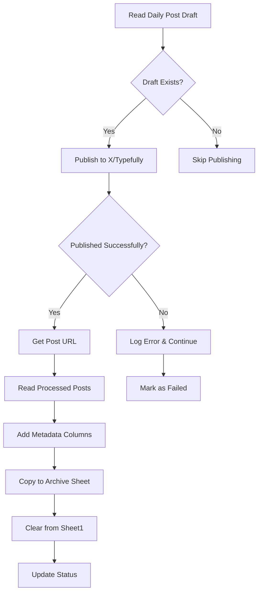

# Google Sheets Handler Implementation Plan

## Overview
Implement a module to upload CSV data to Google Sheets, specifically designed to archive Discord posts containing Twitter/X links on a daily basis.

## Phase 1: Google Cloud Setup (User Action Required)

### Step 1: Create Google Cloud Project
1. Go to [Google Cloud Console](https://console.cloud.google.com/)
2. Create a new project or select existing one
3. Note down the Project ID

### Step 2: Enable Required APIs
1. In Google Cloud Console, go to "APIs & Services" → "Library"
2. Search and enable these APIs:
   - **Google Sheets API**
   - **Google Drive API** (for file access permissions)

### Step 3: Create Service Account
1. Go to "APIs & Services" → "Credentials"
2. Click "Create Credentials" → "Service Account"
3. Fill in:
   - Service account name: `discord-to-sheets-bot`
   - Service account description: "Bot for archiving Discord posts to Google Sheets"
4. Click "Create and Continue"
5. Skip the optional permissions (click "Continue")
6. Click "Done"

### Step 4: Generate Service Account Key
1. Click on the created service account
2. Go to "Keys" tab
3. Click "Add Key" → "Create new key"
4. Choose **JSON** format
5. Download the key file
6. **IMPORTANT**: Save this file as `credentials.json` in project root
7. Add `credentials.json` to `.gitignore` immediately

### Step 5: Share Google Sheet with Service Account
1. Open your target Google Sheet
2. Click "Share" button
3. Add the service account email (found in credentials.json as `client_email`)
   - Format: `discord-to-sheets-bot@PROJECT_ID.iam.gserviceaccount.com`
4. Give "Editor" permissions
5. Click "Send"

### Step 6: Get Google Sheet ID
1. Open your Google Sheet
2. Copy the ID from URL: `https://docs.google.com/spreadsheets/d/SHEET_ID_HERE/edit`
3. Save this ID for `.env` configuration

## Phase 2: Implementation Architecture

### Module Structure
```
modules/sheets_handler.py
├── Class: GoogleSheetsHandler
│   ├── __init__(credentials_path, sheet_id)
│   ├── authenticate() → service object
│   ├── read_csv(file_path) → list of rows
│   ├── append_data(data, sheet_name='Sheet1')
│   ├── clear_sheet(sheet_name='Sheet1')
│   ├── update_sheet_from_csv(csv_path, sheet_name='Sheet1')
│   └── get_last_entry_date(sheet_name='Sheet1') → datetime
```

### Data Flow
1. Read CSV file generated by discord_handler
2. Validate CSV structure matches expected format
3. Connect to Google Sheets using service account
4. Append new data or replace existing data
5. Log success/failure

### CSV Format Expected
```csv
date,time,author,post_link,content,author_link
2025-08-13,13:46,Username,https://twitter.com/...,Tweet content,https://discord.com/users/...
```

## Phase 3: Implementation Details

### Core Functions

#### 1. Authentication
```python
def authenticate(self):
    """Authenticate with Google Sheets API using service account"""
    # Use google-auth and google-api-python-client
    # Return authenticated service object
```

#### 2. CSV Reading
```python
def read_csv(self, file_path: Path) -> List[List[str]]:
    """Read CSV file and return as list of lists"""
    # Use csv.reader
    # Handle encoding issues
    # Validate structure
```

#### 3. Data Append
```python
def append_data(self, data: List[List[str]], sheet_name: str = 'Sheet1'):
    """Append data rows to Google Sheet"""
    # Use batchUpdate for efficiency
    # Handle rate limits
    # Add retry logic with exponential backoff
```

#### 4. Sheet Management
```python
def clear_sheet(self, sheet_name: str = 'Sheet1'):
    """Clear all data from sheet (keep headers)"""
    # Preserve first row (headers)
    # Clear remaining rows
```

#### 5. Duplicate Detection
```python
def get_last_entry_date(self, sheet_name: str = 'Sheet1') -> datetime:
    """Get the date of the last entry to avoid duplicates"""
    # Read last row
    # Parse date
    # Return for comparison
```

## Phase 4: Error Handling Strategy

### API Errors
- **Rate Limiting**: Implement exponential backoff (1s, 2s, 4s, 8s...)
- **Authentication**: Clear error messages, suggest checking credentials
- **Quota Exceeded**: Log and wait, notify user
- **Network Issues**: Retry 3 times before failing

### Data Errors
- **Malformed CSV**: Log specific issues, continue with valid rows
- **Missing Fields**: Use default values or skip row
- **Encoding Issues**: Try UTF-8, then Latin-1, then log error

## Phase 5: Configuration

### Environment Variables (.env)
```env
# Google Sheets Configuration
GOOGLE_CREDENTIALS_PATH=credentials.json
GOOGLE_SHEET_ID=your_sheet_id_here
GOOGLE_SHEET_NAME=Sheet1

# Optional: Batch size for uploads
SHEETS_BATCH_SIZE=100
```

### Config Updates (config.py)
```python
# Google Sheets settings
GOOGLE_CREDENTIALS_PATH = os.getenv('GOOGLE_CREDENTIALS_PATH', 'credentials.json')
GOOGLE_SHEET_ID = os.getenv('GOOGLE_SHEET_ID')
GOOGLE_SHEET_NAME = os.getenv('GOOGLE_SHEET_NAME', 'Sheet1')
SHEETS_BATCH_SIZE = int(os.getenv('SHEETS_BATCH_SIZE', '100'))
```

## Phase 6: Testing Strategy

### Unit Tests
1. Test CSV reading with various formats
2. Test data validation
3. Mock Google Sheets API calls
4. Test error handling scenarios

### Integration Tests
1. Create test Google Sheet
2. Test actual upload with small dataset
3. Test duplicate detection
4. Test rate limit handling

### Manual Testing Checklist
- [ ] Upload 10 rows
- [ ] Upload 1000 rows (batch testing)
- [ ] Handle network interruption
- [ ] Test with existing data in sheet
- [ ] Test clearing and re-uploading

## Phase 7: Usage Example

```python
from modules.sheets_handler import GoogleSheetsHandler
from pathlib import Path

# Initialize handler
handler = GoogleSheetsHandler(
    credentials_path='credentials.json',
    sheet_id='your_sheet_id'
)

# Upload today's posts
csv_file = Path('today_posts_20250814.csv')
handler.update_sheet_from_csv(csv_file, sheet_name='Sheet1')

# Or append without clearing
data = handler.read_csv(csv_file)
handler.append_data(data[1:], sheet_name='Sheet1')  # Skip header
```

## Security Considerations

1. **Never commit `credentials.json`** - Add to .gitignore
2. **Use environment variables** for sheet IDs
3. **Validate sheet permissions** before writing
4. **Log access attempts** for audit trail
5. **Implement read-only mode** for testing

## Dependencies Required

```txt
google-api-python-client>=2.100.0
google-auth>=2.23.0
google-auth-httplib2>=0.2.0
google-auth-oauthlib>=1.0.0
```

## Success Criteria

- [ ] Successfully authenticate with Google Sheets API
- [ ] Upload CSV data without data loss
- [ ] Handle errors gracefully with proper logging
- [ ] Batch operations for large datasets
- [ ] Prevent duplicate entries
- [ ] Complete upload in < 30 seconds for 1000 rows

## Next Steps After Implementation

1. Integrate with discord_handler output
2. Add scheduling for daily uploads
3. Implement data archival strategy (monthly sheets?)
4. Add monitoring and alerting
5. Create backup mechanism

---

# Gemini AI Analyzer Implementation Plan

## Overview
Implement an AI-powered module to analyze Google Sheets content, identify new crypto/Web3 projects from Discord posts, and generate structured daily summaries using Google's Gemini AI (free tier).

## Workflow Overview



## Phase 1: Setup Requirements (User Action Required)

### Step 1: Get Google AI Studio API Key (Free Tier)
1. Go to [Google AI Studio](https://makersuite.google.com/app/apikey)
2. Click "Create API Key"
3. Select your existing Google Cloud project (same one used for Sheets)
4. Copy the API key
5. **IMPORTANT**: Save this key securely, never commit to git

### Step 2: Update Environment Variables
Add to `.env`:
```env
# Existing Google Sheets Configuration
GOOGLE_CREDENTIALS_PATH=credentials.json
GOOGLE_SHEET_ID=your_sheet_id_here

# New: Gemini AI Configuration
GEMINI_API_KEY=your_gemini_api_key_here
GEMINI_MODEL=gemini-1.5-flash  # Free tier model
GEMINI_DAILY_LIMIT=1400  # Leave buffer from 1500 limit
```

### Step 3: Install Dependencies
```bash
pip install google-generativeai
```

## Phase 2: Module Architecture

### Module Structure
```
modules/gemini_analyzer.py
├── Class: GeminiAnalyzer
│   ├── __init__(api_key, model='gemini-1.5-flash')
│   ├── is_new_project(content: str) → bool
│   ├── extract_project_info(content: str) → ProjectInfo
│   ├── generate_summary(content: str, bio: str) → str
│   ├── create_daily_draft(summaries: List[ProjectSummary]) → str
│   └── check_rate_limits() → bool
│
├── Class: SheetAnalyzer
│   ├── __init__(sheets_handler, gemini_analyzer)
│   ├── ensure_columns_exist() → None
│   ├── analyze_all_rows() → List[ProjectSummary]
│   ├── write_summaries(summaries: List[ProjectSummary])
│   ├── generate_and_write_daily_draft()
│   └── run_daily_analysis() → None
│
└── Data Classes:
    ├── ProjectInfo(username, twitter_link, bio)
    └── ProjectSummary(date, project_info, ai_summary)
```

## Phase 3: Implementation Details

### 1. Project Detection Logic
```python
def is_new_project(self, content: str) -> bool:
    """Use Gemini to determine if post is about a new project"""
    
    prompt = f"""
    Analyze this Discord post containing a Twitter/X link.
    Determine if this is announcing or discussing a NEW crypto/Web3 project.
    
    Post content: {content}
    
    Respond with only "YES" or "NO".
    
    Criteria for YES:
    - Mentions new token launch, IDO, or TGE
    - Announces new protocol or dApp
    - Introduces new NFT collection
    - New DeFi platform or tool
    - New blockchain or L2
    
    Criteria for NO:
    - General market discussion
    - Price talk about existing tokens
    - News about established projects
    - Personal opinions without new project info
    """
    
    response = self.model.generate_content(prompt)
    return response.text.strip().upper() == "YES"
```

### 2. Information Extraction
```python
def extract_project_info(self, content: str) -> ProjectInfo:
    """Extract Twitter username and bio from post content"""
    
    prompt = f"""
    Extract project information from this post:
    {content}
    
    Return JSON with:
    - twitter_username: The @username mentioned
    - twitter_link: Full Twitter/X URL
    - bio_description: Project description from the post
    
    If bio not in post, return "No description provided"
    """
    
    response = self.model.generate_content(prompt)
    # Parse JSON response
    return ProjectInfo(**json.loads(response.text))
```

### 3. Summary Generation
```python
def generate_summary(self, content: str, bio: str) -> str:
    """Generate concise project summary"""
    
    prompt = f"""
    Create a 1-2 sentence summary of this crypto project:
    
    Post: {content}
    Bio/Description: {bio}
    
    Focus on:
    - What the project does
    - Key innovation or utility
    - Target market or use case
    
    Keep under 30 words. Be specific and informative.
    """
    
    response = self.model.generate_content(prompt)
    return response.text.strip()
```

### 4. Daily Draft Generation
```python
def create_daily_draft(self, summaries: List[ProjectSummary]) -> str:
    """Format all summaries into structured daily post"""
    
    if not summaries:
        return "No new projects found today."
    
    # Group by date
    grouped = {}
    for summary in summaries:
        date = summary.date
        if date not in grouped:
            grouped[date] = []
        grouped[date].append(summary)
    
    # Format output
    draft_lines = []
    for date, projects in grouped.items():
        draft_lines.append(f"🚀 New/Trending Projects on {date}:\n")
        
        for project in projects:
            line = f"• [@{project.username}]({project.twitter_link}): {project.ai_summary}"
            draft_lines.append(line)
        
        draft_lines.append("")  # Empty line between dates
    
    return "\n".join(draft_lines)
```

## Phase 4: Sheet Integration

### Column Management
```python
def ensure_columns_exist(self):
    """Add AI Summary and Daily Post Draft columns if missing"""
    
    # Get current headers
    headers = self.sheets.get_headers()
    
    # Check for required columns
    if 'AI Summary' not in headers:
        # Add column after 'Content' column
        self.sheets.add_column('AI Summary', after='Content')
    
    if 'Daily Post Draft' not in headers:
        # Add as last column
        self.sheets.add_column('Daily Post Draft')
```

### Batch Processing Strategy
```python
def analyze_all_rows(self) -> List[ProjectSummary]:
    """Process all rows efficiently with rate limiting"""
    
    # Read all data at once
    all_rows = self.sheets.read_all_rows()
    
    summaries = []
    batch = []
    
    for row_idx, row in enumerate(all_rows[1:], start=2):  # Skip header
        # Check if already analyzed
        if row.get('AI Summary'):
            continue
            
        batch.append((row_idx, row))
        
        # Process in batches of 5 to optimize API calls
        if len(batch) >= 5:
            summaries.extend(self._process_batch(batch))
            batch = []
            time.sleep(4)  # Rate limiting: 15 requests/minute
    
    # Process remaining
    if batch:
        summaries.extend(self._process_batch(batch))
    
    return summaries
```

## Phase 5: Rate Limiting & Cost Management

### Free Tier Optimization
```python
class RateLimitManager:
    """Manage Gemini API free tier limits"""
    
    def __init__(self):
        self.daily_requests = 0
        self.minute_requests = 0
        self.last_reset = datetime.now()
        self.last_minute = datetime.now()
        
    def can_make_request(self) -> bool:
        """Check if within rate limits"""
        now = datetime.now()
        
        # Reset daily counter
        if now.date() > self.last_reset.date():
            self.daily_requests = 0
            self.last_reset = now
        
        # Reset minute counter
        if (now - self.last_minute).seconds >= 60:
            self.minute_requests = 0
            self.last_minute = now
        
        # Check limits (conservative)
        if self.daily_requests >= 1400:  # Leave 100 buffer
            return False
        if self.minute_requests >= 14:  # Leave 1 buffer from 15
            return False
            
        return True
    
    def record_request(self):
        """Record API call"""
        self.daily_requests += 1
        self.minute_requests += 1
```

### Prompt Optimization
```python
# Combine multiple analyses in one request to save API calls
def batch_analyze(self, posts: List[str]) -> List[bool]:
    """Analyze multiple posts in single API call"""
    
    combined_prompt = f"""
    Analyze each post below. For each, respond YES if it's about a new crypto project, NO otherwise.
    
    {chr(10).join([f"Post {i+1}: {post}" for i, post in enumerate(posts)])}
    
    Response format:
    Post 1: YES/NO
    Post 2: YES/NO
    ...
    """
    
    response = self.model.generate_content(combined_prompt)
    # Parse response
    return self._parse_batch_response(response.text)
```

## Phase 6: Error Handling

### API Error Management
```python
def handle_api_error(self, error: Exception) -> Optional[str]:
    """Handle Gemini API errors gracefully"""
    
    error_str = str(error).lower()
    
    if "quota" in error_str or "429" in error_str:
        logger.warning("Hit rate limit, waiting until tomorrow")
        return "RATE_LIMITED"
    
    elif "api_key" in error_str:
        logger.error("Invalid API key")
        return "AUTH_ERROR"
    
    elif "timeout" in error_str:
        logger.warning("Request timeout, retrying...")
        return "RETRY"
    
    else:
        logger.error(f"Unexpected error: {error}")
        return "UNKNOWN"
```

## Phase 7: Testing Strategy

### Unit Tests Required
1. Test project detection accuracy
2. Test information extraction
3. Test summary generation quality
4. Mock API responses for rate limit testing
5. Test daily draft formatting

### Integration Test Checklist
- [ ] Process 10 sample posts
- [ ] Verify AI Summary column creation
- [ ] Test with mixed project/non-project posts
- [ ] Validate daily draft generation
- [ ] Test rate limit handling
- [ ] Verify no data corruption in sheet

## Phase 8: Usage Example

```python
from modules.sheets_handler import GoogleSheetsHandler
from modules.gemini_analyzer import GeminiAnalyzer, SheetAnalyzer

# Initialize components
sheets = GoogleSheetsHandler(
    credentials_path='credentials.json',
    sheet_id=GOOGLE_SHEET_ID
)

gemini = GeminiAnalyzer(
    api_key=GEMINI_API_KEY,
    model='gemini-1.5-flash'
)

# Run analysis
analyzer = SheetAnalyzer(sheets, gemini)
analyzer.run_daily_analysis()

# Result: Sheet updated with AI summaries and daily draft
```

## Success Criteria

- [ ] Accurately identify new projects (>80% accuracy)
- [ ] Generate concise, informative summaries
- [ ] Stay within free tier limits (1500 requests/day)
- [ ] Process 100 posts in under 5 minutes
- [ ] Generate formatted daily draft automatically
- [ ] Handle errors without data loss

## Security Considerations

1. **Never log API keys** - Redact in error messages
2. **Validate content length** - Prevent prompt injection
3. **Sanitize AI responses** - Remove any inappropriate content
4. **Rate limit protection** - Prevent accidental quota exhaustion
5. **Cache responses** - Avoid re-analyzing identical content

## Cost Analysis

### Free Tier Usage (Google AI Studio)
- **Daily Limit**: 1,500 requests
- **Per Minute**: 15 requests
- **Your Usage**: ~100-200 requests/day (well within limits)
- **Cost**: $0 (free tier)

### If Scaling Beyond Free Tier
- Move to Vertex AI with pay-per-use
- Implement caching layer
- Batch more aggressively
- Consider weekly instead of daily analysis

## Next Steps

1. Get Gemini API key from Google AI Studio
2. Test API connection with simple prompt
3. Implement core analyzer module
4. Add sheet integration
5. Test with sample data
6. Deploy to production

---

# X API Publishing & Archiving Implementation Plan

## Overview
Implement automated publishing of AI-generated daily summaries to X (Twitter) and archive processed posts with metadata tracking. This completes the full pipeline: Discord → Sheets → AI Analysis → X Publishing → Archive.

## Workflow Overview



## X API Setup Guide (User Action Required)

### Step-by-Step X API v2 Credentials Setup

#### 1. Create X Developer Account
1. Go to [https://developer.twitter.com](https://developer.twitter.com)
2. Click "Sign up" or "Apply" for developer access
3. Log in with your X/Twitter account
4. Select your use case:
   - Choose "Making a bot" or "Building customized solutions"
   - Select "No" for will you make Twitter content available to government entity

#### 2. Complete Developer Application
1. **Basic Information**:
   - Account name: Your X handle
   - Country: Your country
   - Coding experience: Select appropriate level

2. **Intended Use** (Example responses):
   ```
   Q: How will you use the X API?
   A: "I will use the API to automatically publish daily summaries of 
   crypto/Web3 projects discovered through community discussions. 
   The bot will post curated lists of new projects with brief 
   descriptions to help followers discover emerging opportunities."
   
   Q: Are you planning to analyze X data?
   A: "No, only publishing content."
   
   Q: Will your app use Tweet, Retweet, Like, Follow, or Direct Message?
   A: "Yes, only Tweet functionality to post daily summaries."
   
   Q: Do you plan to display Tweets or aggregate data?
   A: "No, only posting original summaries."
   ```

3. **Review & Submit**:
   - Review all information
   - Accept Developer Agreement
   - Submit application
   - Wait for approval (usually instant for basic access)

#### 3. Create a Project and App
1. Once approved, go to [Developer Portal](https://developer.twitter.com/en/portal/dashboard)
2. Click "Create Project":
   - Project name: "Discord to X Publisher" (or your choice)
   - Use case: "Making a bot"
   - Project description: "Publishes daily crypto project summaries"

3. Create an App within the project:
   - App name: Must be unique (e.g., "YourName_Discord_Publisher")
   - Click "Complete"

#### 4. Generate API Keys and Tokens
1. After creating the app, you'll see "Keys and tokens"
2. **Save these immediately** (shown only once):
   ```
   API Key: [Your API Key]
   API Key Secret: [Your API Secret]
   Bearer Token: [Your Bearer Token]
   ```

3. Generate Access Token & Secret:
   - Go to "Keys and tokens" tab
   - Under "Authentication Tokens"
   - Click "Generate" for Access Token and Secret
   - **Set permissions**: Read and Write
   - Save these credentials:
   ```
   Access Token: [Your Access Token]
   Access Token Secret: [Your Access Token Secret]
   ```

#### 5. Configure App Permissions
1. Go to "Settings" → "User authentication settings"
2. Click "Set up"
3. Configure:
   - **App permissions**: Read and write
   - **Type of App**: Web App, Automated App or Bot
   - **App info**:
     - Callback URL: `http://localhost:3000/callback` (not used but required)
     - Website URL: Your website or `https://example.com`
4. Save settings

#### 6. Verify Rate Limits
1. Check your access level:
   - **Essential**: 500 posts/month
   - **Elevated**: 1,500 posts/month (apply if needed)
   - **Basic ($100/month)**: 3,000 posts/month

2. To apply for Elevated access:
   - Go to "Products" → "X API v2"
   - Click "Apply for Elevated"
   - Fill out additional use case details

#### 7. Test Your Credentials
```python
import tweepy

# Test authentication
client = tweepy.Client(
    consumer_key="YOUR_API_KEY",
    consumer_secret="YOUR_API_KEY_SECRET",
    access_token="YOUR_ACCESS_TOKEN",
    access_token_secret="YOUR_ACCESS_TOKEN_SECRET"
)

# Test with a simple tweet
try:
    response = client.create_tweet(text="Hello from API test! 🚀")
    print(f"Success! Tweet ID: {response.data['id']}")
except Exception as e:
    print(f"Error: {e}")
```

#### 8. Save Credentials to .env
```env
# X API Configuration
X_API_KEY=your_api_key_here
X_API_SECRET=your_api_key_secret_here
X_ACCESS_TOKEN=your_access_token_here
X_ACCESS_TOKEN_SECRET=your_access_token_secret_here
```

### Important Notes
- **Never share or commit** these credentials
- **Rate Limits**: Essential tier = ~16 tweets/day, Elevated = ~50 tweets/day
- **Approval Time**: Usually instant for Essential, 1-2 days for Elevated
- **Bot Rules**: Must comply with X's automation rules
- **Account Requirements**: Your X account must have:
  - Verified email
  - Verified phone number
  - Account older than 30 days

### Troubleshooting Common Issues

1. **"User is not Authorized" Error**:
   - Regenerate tokens with correct permissions
   - Ensure app has "Read and Write" access

2. **"Rate limit exceeded"**:
   - Check your tier limits
   - Implement proper rate limiting in code

3. **"Could not authenticate"**:
   - Verify all 4 credentials are correct
   - Check for extra spaces in .env file

4. **Application Rejected**:
   - Provide more detailed use case
   - Emphasize legitimate use (not spam)
   - Mention manual curation aspect

## Part 1: X/Twitter Publishing Module

### Module Structure
```
modules/x_publisher.py
├── Class: XPublisher (Abstract Base)
│   ├── __init__(api_credentials)
│   ├── authenticate() → bool
│   ├── publish(content: str) → PublishResult
│   └── validate_content(content: str) → bool
│
├── Class: TwitterAPIPublisher(XPublisher)
│   ├── Uses X API v2 (OAuth 2.0)
│   ├── Handle rate limits
│   └── Thread support
│
├── Class: TypefullyPublisher(XPublisher)
│   ├── Uses Typefully API
│   ├── Schedule drafts
│   └── Simpler authentication
│
└── Data Classes:
    └── PublishResult(success, url, error_msg, post_id)
```

### Option A: X API v2 (Direct Twitter Publishing)

#### Prerequisites
1. Apply for X API access at https://developer.twitter.com
2. Create a Project and App
3. Get credentials:
   - API Key
   - API Secret
   - Access Token
   - Access Token Secret

#### Environment Variables
```env
# X API Configuration
X_API_KEY=your_api_key
X_API_SECRET=your_api_secret
X_ACCESS_TOKEN=your_access_token
X_ACCESS_TOKEN_SECRET=your_access_token_secret
```

#### Implementation
```python
import tweepy
from typing import Optional

class TwitterAPIPublisher(XPublisher):
    def __init__(self, api_key: str, api_secret: str, 
                 access_token: str, access_token_secret: str):
        self.client = tweepy.Client(
            consumer_key=api_key,
            consumer_secret=api_secret,
            access_token=access_token,
            access_token_secret=access_token_secret
        )
    
    def publish(self, content: str) -> PublishResult:
        """Publish content as a thread if needed"""
        try:
            # Split content if > 280 chars
            tweets = self._split_into_tweets(content)
            
            # Post first tweet
            response = self.client.create_tweet(text=tweets[0])
            tweet_id = response.data['id']
            tweet_url = f"https://twitter.com/user/status/{tweet_id}"
            
            # Thread remaining tweets if any
            for tweet in tweets[1:]:
                response = self.client.create_tweet(
                    text=tweet,
                    in_reply_to_tweet_id=tweet_id
                )
                tweet_id = response.data['id']
            
            return PublishResult(
                success=True,
                url=tweet_url,
                post_id=tweet_id
            )
        except Exception as e:
            return PublishResult(
                success=False,
                error_msg=str(e)
            )
```

### Option B: Typefully API (Recommended - Simpler)

#### Prerequisites
1. Create account at https://typefully.com
2. Get API key from settings
3. No approval process needed

#### Environment Variables
```env
# Typefully Configuration
TYPEFULLY_API_KEY=your_typefully_api_key
TYPEFULLY_SCHEDULE=next-free-slot  # or specific time
```

#### Implementation
```python
import requests
from datetime import datetime

class TypefullyPublisher(XPublisher):
    def __init__(self, api_key: str):
        self.api_key = api_key
        self.base_url = "https://api.typefully.com/v1"
        self.headers = {"X-API-KEY": f"Bearer {api_key}"}
    
    def publish(self, content: str, schedule: str = "next-free-slot") -> PublishResult:
        """Create a draft in Typefully"""
        try:
            payload = {
                "content": content,
                "schedule-date": schedule
            }
            
            response = requests.post(
                f"{self.base_url}/drafts/",
                headers=self.headers,
                json=payload,
                timeout=30
            )
            response.raise_for_status()
            
            data = response.json()
            draft_id = data.get('id')
            
            # Get draft URL (may need separate API call)
            draft_url = f"https://typefully.com/drafts/{draft_id}"
            
            return PublishResult(
                success=True,
                url=draft_url,
                post_id=draft_id
            )
        except requests.exceptions.RequestException as e:
            return PublishResult(
                success=False,
                error_msg=str(e)
            )
```

### Content Formatting
```python
def format_for_publishing(daily_draft: str) -> str:
    """Format the daily draft for X/Twitter"""
    
    # Add hashtags
    hashtags = "\n\n#CryptoProjects #Web3 #DeFi #NFTs"
    
    # Check length
    if len(daily_draft) + len(hashtags) <= 280:
        return daily_draft + hashtags
    
    # Truncate if needed
    max_content_length = 280 - len(hashtags) - 3  # -3 for "..."
    truncated = daily_draft[:max_content_length] + "..."
    
    return truncated + hashtags
```

## Part 2: Archive System Module

### Module Structure
```
modules/archive_handler.py
├── Class: ArchiveHandler
│   ├── __init__(sheets_handler: GoogleSheetsHandler)
│   ├── ensure_archive_sheet_exists() → bool
│   ├── add_metadata_columns() → None
│   ├── archive_processed_posts(metadata: Dict) → int
│   ├── clear_processed_from_source() → bool
│   └── rollback_on_failure() → bool
│
└── Data Classes:
    └── ArchiveMetadata(date_processed, x_post_url, status, error_msg)
```

### Archive Sheet Structure
```
Archive Sheet Columns:
- date (from original)
- time (from original)
- author (from original)
- post_link (from original)
- content (from original)
- author_link (from original)
- AI Summary (from processing)
- Date Processed (NEW - timestamp)
- X Post URL (NEW - published tweet URL)
- Processing Status (NEW - success/failed/skipped)
- Error Message (NEW - if failed)
```

### Implementation
```python
from datetime import datetime
from typing import List, Dict, Optional

class ArchiveHandler:
    def __init__(self, sheets_handler: GoogleSheetsHandler):
        self.sheets = sheets_handler
        self.archive_sheet_name = "Archive"
        self.source_sheet_name = "Sheet1"
    
    def ensure_archive_sheet_exists(self) -> bool:
        """Create Archive sheet if it doesn't exist"""
        try:
            # Check if Archive sheet exists
            sheet_metadata = self.sheets.get_sheet_metadata()
            sheet_names = [sheet['properties']['title'] 
                          for sheet in sheet_metadata['sheets']]
            
            if self.archive_sheet_name not in sheet_names:
                # Create new sheet
                self.sheets.create_sheet(self.archive_sheet_name)
                
                # Add headers
                headers = [
                    'date', 'time', 'author', 'post_link', 
                    'content', 'author_link', 'AI Summary',
                    'Date Processed', 'X Post URL', 
                    'Processing Status', 'Error Message'
                ]
                self.sheets.append_data([headers], self.archive_sheet_name)
                logger.info(f"Created Archive sheet with headers")
                
            return True
        except Exception as e:
            logger.error(f"Failed to ensure archive sheet: {e}")
            return False
    
    def archive_processed_posts(self, 
                               x_post_url: Optional[str] = None,
                               status: str = "success") -> int:
        """
        Move posts with AI summaries to Archive sheet
        
        Returns:
            Number of posts archived
        """
        try:
            # Read all data from Sheet1
            source_data = self.sheets.get_sheet_data(self.source_sheet_name)
            
            if len(source_data) <= 1:
                logger.info("No data to archive")
                return 0
            
            headers = source_data[0]
            data_rows = source_data[1:]
            
            # Find AI Summary column
            ai_summary_idx = headers.index('AI Summary') if 'AI Summary' in headers else -1
            
            if ai_summary_idx == -1:
                logger.warning("AI Summary column not found")
                return 0
            
            # Separate processed and unprocessed
            processed_rows = []
            unprocessed_rows = []
            
            for row in data_rows:
                # Ensure row has enough columns
                while len(row) <= ai_summary_idx:
                    row.append('')
                
                if row[ai_summary_idx]:  # Has AI summary
                    # Add metadata
                    archived_row = row.copy()
                    archived_row.extend([
                        datetime.now().isoformat(),  # Date Processed
                        x_post_url or '',  # X Post URL
                        status,  # Processing Status
                        ''  # Error Message
                    ])
                    processed_rows.append(archived_row)
                else:
                    unprocessed_rows.append(row)
            
            if processed_rows:
                # Append to Archive sheet
                self.sheets.append_data(processed_rows, self.archive_sheet_name)
                logger.info(f"Archived {len(processed_rows)} posts")
                
                # Update Sheet1 with only unprocessed rows
                self.sheets.clear_sheet(self.source_sheet_name, preserve_headers=True)
                if unprocessed_rows:
                    self.sheets.append_data(unprocessed_rows, self.source_sheet_name)
                
                return len(processed_rows)
            
            return 0
            
        except Exception as e:
            logger.error(f"Failed to archive posts: {e}")
            raise
    
    def clear_daily_draft_column(self) -> bool:
        """Clear the Daily Post Draft column after publishing"""
        try:
            # Read current data
            data = self.sheets.get_sheet_data(self.source_sheet_name)
            headers = data[0]
            
            # Find Daily Post Draft column
            draft_col_idx = headers.index('Daily Post Draft') if 'Daily Post Draft' in headers else -1
            
            if draft_col_idx >= 0:
                # Clear the column (except header)
                for i in range(1, len(data)):
                    if len(data[i]) > draft_col_idx:
                        data[i][draft_col_idx] = ''
                
                # Rewrite the sheet
                self.sheets.clear_sheet(self.source_sheet_name, preserve_headers=False)
                self.sheets.append_data(data, self.source_sheet_name)
                
                logger.info("Cleared Daily Post Draft column")
                return True
            
            return False
            
        except Exception as e:
            logger.error(f"Failed to clear draft column: {e}")
            return False
```

## Part 3: Workflow Integration

### Main Workflow Orchestrator
```python
# modules/workflow_orchestrator.py

class WorkflowOrchestrator:
    def __init__(self, sheets_handler, gemini_analyzer, publisher, archive_handler):
        self.sheets = sheets_handler
        self.gemini = gemini_analyzer
        self.publisher = publisher
        self.archiver = archive_handler
    
    def run_complete_workflow(self) -> Dict:
        """
        Complete workflow: Analyze → Publish → Archive
        """
        results = {
            'analysis': False,
            'publishing': False,
            'archiving': False,
            'posts_processed': 0,
            'x_post_url': None,
            'errors': []
        }
        
        try:
            # Step 1: Run Gemini Analysis
            logger.info("Starting AI analysis...")
            analyzer = SheetAnalyzer(self.sheets, self.gemini)
            analyzer.run_daily_analysis()
            results['analysis'] = True
            
            # Step 2: Read Daily Draft
            daily_draft = self._get_daily_draft()
            
            if daily_draft:
                # Step 3: Publish to X
                logger.info("Publishing to X...")
                publish_result = self.publisher.publish(daily_draft)
                
                if publish_result.success:
                    results['publishing'] = True
                    results['x_post_url'] = publish_result.url
                    logger.info(f"Published: {publish_result.url}")
                else:
                    results['errors'].append(f"Publishing failed: {publish_result.error_msg}")
            
            # Step 4: Archive Processed Posts
            logger.info("Archiving processed posts...")
            posts_archived = self.archiver.archive_processed_posts(
                x_post_url=results['x_post_url'],
                status='success' if results['publishing'] else 'analysis_only'
            )
            
            results['archiving'] = True
            results['posts_processed'] = posts_archived
            
            # Step 5: Clear daily draft column
            self.archiver.clear_daily_draft_column()
            
            logger.info(f"Workflow complete: {posts_archived} posts processed")
            
        except Exception as e:
            logger.error(f"Workflow failed: {e}")
            results['errors'].append(str(e))
        
        return results
    
    def _get_daily_draft(self) -> Optional[str]:
        """Get the daily draft from Sheet1"""
        try:
            data = self.sheets.get_sheet_data()
            headers = data[0]
            
            draft_col_idx = headers.index('Daily Post Draft') if 'Daily Post Draft' in headers else -1
            
            if draft_col_idx >= 0 and len(data) > 1:
                # Check first data row for draft
                if len(data[1]) > draft_col_idx:
                    return data[1][draft_col_idx]
            
            return None
        except Exception as e:
            logger.error(f"Failed to get daily draft: {e}")
            return None
```

## Part 4: Error Handling & Recovery

### Rollback Mechanism
```python
class TransactionManager:
    """Manage atomic operations with rollback capability"""
    
    def __init__(self):
        self.backup_data = {}
        self.operations = []
    
    def backup_sheet(self, sheets_handler, sheet_name):
        """Backup sheet data before modifications"""
        self.backup_data[sheet_name] = sheets_handler.get_sheet_data(sheet_name)
        
    def add_operation(self, operation, rollback_fn):
        """Track operations for potential rollback"""
        self.operations.append({
            'operation': operation,
            'rollback': rollback_fn,
            'completed': False
        })
    
    def rollback(self):
        """Rollback all completed operations"""
        for op in reversed(self.operations):
            if op['completed']:
                try:
                    op['rollback']()
                    logger.info(f"Rolled back: {op['operation']}")
                except Exception as e:
                    logger.error(f"Rollback failed: {e}")
```

### Rate Limiting for Publishing
```python
class PublishRateLimiter:
    """Handle X API rate limits"""
    
    def __init__(self, posts_per_day=50, posts_per_15min=5):
        self.daily_limit = posts_per_day
        self.window_limit = posts_per_15min
        self.daily_posts = 0
        self.window_posts = []
        self.last_reset = datetime.now()
    
    def can_publish(self) -> bool:
        """Check if we can publish now"""
        now = datetime.now()
        
        # Reset daily counter
        if now.date() > self.last_reset.date():
            self.daily_posts = 0
            self.last_reset = now
        
        # Check daily limit
        if self.daily_posts >= self.daily_limit:
            return False
        
        # Check 15-minute window
        window_start = now - timedelta(minutes=15)
        self.window_posts = [t for t in self.window_posts if t > window_start]
        
        return len(self.window_posts) < self.window_limit
    
    def record_post(self):
        """Record a successful post"""
        self.daily_posts += 1
        self.window_posts.append(datetime.now())
```

## Part 5: Configuration & Setup

### Environment Variables
```env
# Publishing Configuration (choose one)
PUBLISHER_TYPE=typefully  # or 'twitter'

# Typefully API
TYPEFULLY_API_KEY=your_api_key
TYPEFULLY_SCHEDULE=next-free-slot

# X API (if using Twitter directly)
X_API_KEY=your_api_key
X_API_SECRET=your_api_secret
X_ACCESS_TOKEN=your_access_token
X_ACCESS_TOKEN_SECRET=your_access_token_secret

# Archive Configuration
ARCHIVE_SHEET_NAME=Archive
ARCHIVE_BATCH_SIZE=50
```

### Config Updates
```python
# config.py additions

# Publishing settings
PUBLISHER_TYPE = os.getenv('PUBLISHER_TYPE', 'typefully')

# Typefully settings
TYPEFULLY_API_KEY = os.getenv('TYPEFULLY_API_KEY')
TYPEFULLY_SCHEDULE = os.getenv('TYPEFULLY_SCHEDULE', 'next-free-slot')

# X API settings
X_API_KEY = os.getenv('X_API_KEY')
X_API_SECRET = os.getenv('X_API_SECRET')
X_ACCESS_TOKEN = os.getenv('X_ACCESS_TOKEN')
X_ACCESS_TOKEN_SECRET = os.getenv('X_ACCESS_TOKEN_SECRET')

# Archive settings
ARCHIVE_SHEET_NAME = os.getenv('ARCHIVE_SHEET_NAME', 'Archive')
ARCHIVE_BATCH_SIZE = int(os.getenv('ARCHIVE_BATCH_SIZE', '50'))
```

## Part 6: Testing Strategy

### Unit Tests
```python
# tests/test_x_publisher.py
class TestXPublisher(unittest.TestCase):
    def test_content_validation(self):
        """Test content length validation"""
        
    def test_tweet_splitting(self):
        """Test splitting long content into threads"""
        
    def test_rate_limiting(self):
        """Test rate limit detection"""

# tests/test_archive_handler.py
class TestArchiveHandler(unittest.TestCase):
    def test_archive_creation(self):
        """Test Archive sheet creation"""
        
    def test_metadata_addition(self):
        """Test adding metadata columns"""
        
    def test_rollback(self):
        """Test rollback on failure"""
```

### Integration Test Script
```python
# test_publishing_integration.py
def test_complete_workflow():
    """Test the complete publishing and archiving workflow"""
    
    # 1. Create test data in Sheet1
    # 2. Run AI analysis
    # 3. Publish draft (to test account)
    # 4. Archive processed posts
    # 5. Verify Archive sheet
    # 6. Verify Sheet1 cleared
```

## Success Criteria

- [ ] Successfully authenticate with X/Typefully API
- [ ] Publish daily draft without errors
- [ ] Archive processed posts with metadata
- [ ] Clear processed posts from Sheet1
- [ ] Handle API rate limits gracefully
- [ ] Rollback on failure without data loss
- [ ] Complete workflow in < 60 seconds
- [ ] Maintain data integrity throughout

## Security Considerations

1. **API Keys**: Never log or expose API keys
2. **Content Validation**: Sanitize content before publishing
3. **Rate Limiting**: Respect API limits to avoid bans
4. **Backup**: Always backup before destructive operations
5. **Audit Trail**: Log all publishing attempts

## Next Steps

1. Choose publishing platform (X API or Typefully)
2. Obtain API credentials
3. Implement publisher module
4. Implement archive handler
5. Create workflow orchestrator
6. Test with sample data
7. Deploy to production