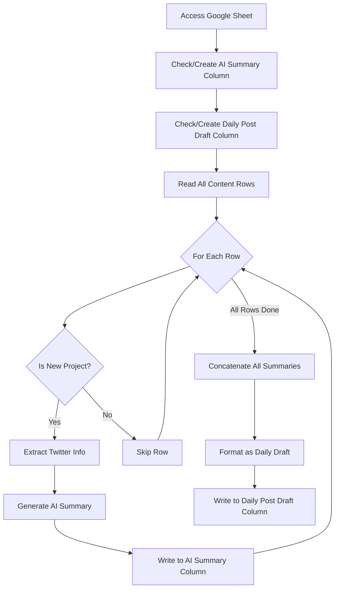

# Google Sheets Handler Implementation Plan

## Overview
Implement a module to upload CSV data to Google Sheets, specifically designed to archive Discord posts containing Twitter/X links on a daily basis.

## Phase 1: Google Cloud Setup (User Action Required)

### Step 1: Create Google Cloud Project
1. Go to [Google Cloud Console](https://console.cloud.google.com/)
2. Create a new project or select existing one
3. Note down the Project ID

### Step 2: Enable Required APIs
1. In Google Cloud Console, go to "APIs & Services" → "Library"
2. Search and enable these APIs:
   - **Google Sheets API**
   - **Google Drive API** (for file access permissions)

### Step 3: Create Service Account
1. Go to "APIs & Services" → "Credentials"
2. Click "Create Credentials" → "Service Account"
3. Fill in:
   - Service account name: `discord-to-sheets-bot`
   - Service account description: "Bot for archiving Discord posts to Google Sheets"
4. Click "Create and Continue"
5. Skip the optional permissions (click "Continue")
6. Click "Done"

### Step 4: Generate Service Account Key
1. Click on the created service account
2. Go to "Keys" tab
3. Click "Add Key" → "Create new key"
4. Choose **JSON** format
5. Download the key file
6. **IMPORTANT**: Save this file as `credentials.json` in project root
7. Add `credentials.json` to `.gitignore` immediately

### Step 5: Share Google Sheet with Service Account
1. Open your target Google Sheet
2. Click "Share" button
3. Add the service account email (found in credentials.json as `client_email`)
   - Format: `discord-to-sheets-bot@PROJECT_ID.iam.gserviceaccount.com`
4. Give "Editor" permissions
5. Click "Send"

### Step 6: Get Google Sheet ID
1. Open your Google Sheet
2. Copy the ID from URL: `https://docs.google.com/spreadsheets/d/SHEET_ID_HERE/edit`
3. Save this ID for `.env` configuration

## Phase 2: Implementation Architecture

### Module Structure
```
modules/sheets_handler.py
├── Class: GoogleSheetsHandler
│   ├── __init__(credentials_path, sheet_id)
│   ├── authenticate() → service object
│   ├── read_csv(file_path) → list of rows
│   ├── append_data(data, sheet_name='Sheet1')
│   ├── clear_sheet(sheet_name='Sheet1')
│   ├── update_sheet_from_csv(csv_path, sheet_name='Sheet1')
│   └── get_last_entry_date(sheet_name='Sheet1') → datetime
```

### Data Flow
1. Read CSV file generated by discord_handler
2. Validate CSV structure matches expected format
3. Connect to Google Sheets using service account
4. Append new data or replace existing data
5. Log success/failure

### CSV Format Expected
```csv
date,time,author,post_link,content,author_link
2025-08-13,13:46,Username,https://twitter.com/...,Tweet content,https://discord.com/users/...
```

## Phase 3: Implementation Details

### Core Functions

#### 1. Authentication
```python
def authenticate(self):
    """Authenticate with Google Sheets API using service account"""
    # Use google-auth and google-api-python-client
    # Return authenticated service object
```

#### 2. CSV Reading
```python
def read_csv(self, file_path: Path) -> List[List[str]]:
    """Read CSV file and return as list of lists"""
    # Use csv.reader
    # Handle encoding issues
    # Validate structure
```

#### 3. Data Append
```python
def append_data(self, data: List[List[str]], sheet_name: str = 'Sheet1'):
    """Append data rows to Google Sheet"""
    # Use batchUpdate for efficiency
    # Handle rate limits
    # Add retry logic with exponential backoff
```

#### 4. Sheet Management
```python
def clear_sheet(self, sheet_name: str = 'Sheet1'):
    """Clear all data from sheet (keep headers)"""
    # Preserve first row (headers)
    # Clear remaining rows
```

#### 5. Duplicate Detection
```python
def get_last_entry_date(self, sheet_name: str = 'Sheet1') -> datetime:
    """Get the date of the last entry to avoid duplicates"""
    # Read last row
    # Parse date
    # Return for comparison
```

## Phase 4: Error Handling Strategy

### API Errors
- **Rate Limiting**: Implement exponential backoff (1s, 2s, 4s, 8s...)
- **Authentication**: Clear error messages, suggest checking credentials
- **Quota Exceeded**: Log and wait, notify user
- **Network Issues**: Retry 3 times before failing

### Data Errors
- **Malformed CSV**: Log specific issues, continue with valid rows
- **Missing Fields**: Use default values or skip row
- **Encoding Issues**: Try UTF-8, then Latin-1, then log error

## Phase 5: Configuration

### Environment Variables (.env)
```env
# Google Sheets Configuration
GOOGLE_CREDENTIALS_PATH=credentials.json
GOOGLE_SHEET_ID=your_sheet_id_here
GOOGLE_SHEET_NAME=Sheet1

# Optional: Batch size for uploads
SHEETS_BATCH_SIZE=100
```

### Config Updates (config.py)
```python
# Google Sheets settings
GOOGLE_CREDENTIALS_PATH = os.getenv('GOOGLE_CREDENTIALS_PATH', 'credentials.json')
GOOGLE_SHEET_ID = os.getenv('GOOGLE_SHEET_ID')
GOOGLE_SHEET_NAME = os.getenv('GOOGLE_SHEET_NAME', 'Sheet1')
SHEETS_BATCH_SIZE = int(os.getenv('SHEETS_BATCH_SIZE', '100'))
```

## Phase 6: Testing Strategy

### Unit Tests
1. Test CSV reading with various formats
2. Test data validation
3. Mock Google Sheets API calls
4. Test error handling scenarios

### Integration Tests
1. Create test Google Sheet
2. Test actual upload with small dataset
3. Test duplicate detection
4. Test rate limit handling

### Manual Testing Checklist
- [ ] Upload 10 rows
- [ ] Upload 1000 rows (batch testing)
- [ ] Handle network interruption
- [ ] Test with existing data in sheet
- [ ] Test clearing and re-uploading

## Phase 7: Usage Example

```python
from modules.sheets_handler import GoogleSheetsHandler
from pathlib import Path

# Initialize handler
handler = GoogleSheetsHandler(
    credentials_path='credentials.json',
    sheet_id='your_sheet_id'
)

# Upload today's posts
csv_file = Path('today_posts_20250814.csv')
handler.update_sheet_from_csv(csv_file, sheet_name='Sheet1')

# Or append without clearing
data = handler.read_csv(csv_file)
handler.append_data(data[1:], sheet_name='Sheet1')  # Skip header
```

## Security Considerations

1. **Never commit `credentials.json`** - Add to .gitignore
2. **Use environment variables** for sheet IDs
3. **Validate sheet permissions** before writing
4. **Log access attempts** for audit trail
5. **Implement read-only mode** for testing

## Dependencies Required

```txt
google-api-python-client>=2.100.0
google-auth>=2.23.0
google-auth-httplib2>=0.2.0
google-auth-oauthlib>=1.0.0
```

## Success Criteria

- [ ] Successfully authenticate with Google Sheets API
- [ ] Upload CSV data without data loss
- [ ] Handle errors gracefully with proper logging
- [ ] Batch operations for large datasets
- [ ] Prevent duplicate entries
- [ ] Complete upload in < 30 seconds for 1000 rows

## Next Steps After Implementation

1. Integrate with discord_handler output
2. Add scheduling for daily uploads
3. Implement data archival strategy (monthly sheets?)
4. Add monitoring and alerting
5. Create backup mechanism

---

# Gemini AI Analyzer Implementation Plan

## Overview
Implement an AI-powered module to analyze Google Sheets content, identify new crypto/Web3 projects from Discord posts, and generate structured daily summaries using Google's Gemini AI (free tier).

## Workflow Overview



## Phase 1: Setup Requirements (User Action Required)

### Step 1: Get Google AI Studio API Key (Free Tier)
1. Go to [Google AI Studio](https://makersuite.google.com/app/apikey)
2. Click "Create API Key"
3. Select your existing Google Cloud project (same one used for Sheets)
4. Copy the API key
5. **IMPORTANT**: Save this key securely, never commit to git

### Step 2: Update Environment Variables
Add to `.env`:
```env
# Existing Google Sheets Configuration
GOOGLE_CREDENTIALS_PATH=credentials.json
GOOGLE_SHEET_ID=your_sheet_id_here

# New: Gemini AI Configuration
GEMINI_API_KEY=your_gemini_api_key_here
GEMINI_MODEL=gemini-1.5-flash  # Free tier model
GEMINI_DAILY_LIMIT=1400  # Leave buffer from 1500 limit
```

### Step 3: Install Dependencies
```bash
pip install google-generativeai
```

## Phase 2: Module Architecture

### Module Structure
```
modules/gemini_analyzer.py
├── Class: GeminiAnalyzer
│   ├── __init__(api_key, model='gemini-1.5-flash')
│   ├── is_new_project(content: str) → bool
│   ├── extract_project_info(content: str) → ProjectInfo
│   ├── generate_summary(content: str, bio: str) → str
│   ├── create_daily_draft(summaries: List[ProjectSummary]) → str
│   └── check_rate_limits() → bool
│
├── Class: SheetAnalyzer
│   ├── __init__(sheets_handler, gemini_analyzer)
│   ├── ensure_columns_exist() → None
│   ├── analyze_all_rows() → List[ProjectSummary]
│   ├── write_summaries(summaries: List[ProjectSummary])
│   ├── generate_and_write_daily_draft()
│   └── run_daily_analysis() → None
│
└── Data Classes:
    ├── ProjectInfo(username, twitter_link, bio)
    └── ProjectSummary(date, project_info, ai_summary)
```

## Phase 3: Implementation Details

### 1. Project Detection Logic
```python
def is_new_project(self, content: str) -> bool:
    """Use Gemini to determine if post is about a new project"""
    
    prompt = f"""
    Analyze this Discord post containing a Twitter/X link.
    Determine if this is announcing or discussing a NEW crypto/Web3 project.
    
    Post content: {content}
    
    Respond with only "YES" or "NO".
    
    Criteria for YES:
    - Mentions new token launch, IDO, or TGE
    - Announces new protocol or dApp
    - Introduces new NFT collection
    - New DeFi platform or tool
    - New blockchain or L2
    
    Criteria for NO:
    - General market discussion
    - Price talk about existing tokens
    - News about established projects
    - Personal opinions without new project info
    """
    
    response = self.model.generate_content(prompt)
    return response.text.strip().upper() == "YES"
```

### 2. Information Extraction
```python
def extract_project_info(self, content: str) -> ProjectInfo:
    """Extract Twitter username and bio from post content"""
    
    prompt = f"""
    Extract project information from this post:
    {content}
    
    Return JSON with:
    - twitter_username: The @username mentioned
    - twitter_link: Full Twitter/X URL
    - bio_description: Project description from the post
    
    If bio not in post, return "No description provided"
    """
    
    response = self.model.generate_content(prompt)
    # Parse JSON response
    return ProjectInfo(**json.loads(response.text))
```

### 3. Summary Generation
```python
def generate_summary(self, content: str, bio: str) -> str:
    """Generate concise project summary"""
    
    prompt = f"""
    Create a 1-2 sentence summary of this crypto project:
    
    Post: {content}
    Bio/Description: {bio}
    
    Focus on:
    - What the project does
    - Key innovation or utility
    - Target market or use case
    
    Keep under 30 words. Be specific and informative.
    """
    
    response = self.model.generate_content(prompt)
    return response.text.strip()
```

### 4. Daily Draft Generation
```python
def create_daily_draft(self, summaries: List[ProjectSummary]) -> str:
    """Format all summaries into structured daily post"""
    
    if not summaries:
        return "No new projects found today."
    
    # Group by date
    grouped = {}
    for summary in summaries:
        date = summary.date
        if date not in grouped:
            grouped[date] = []
        grouped[date].append(summary)
    
    # Format output
    draft_lines = []
    for date, projects in grouped.items():
        draft_lines.append(f"🚀 New/Trending Projects on {date}:\n")
        
        for project in projects:
            line = f"• [@{project.username}]({project.twitter_link}): {project.ai_summary}"
            draft_lines.append(line)
        
        draft_lines.append("")  # Empty line between dates
    
    return "\n".join(draft_lines)
```

## Phase 4: Sheet Integration

### Column Management
```python
def ensure_columns_exist(self):
    """Add AI Summary and Daily Post Draft columns if missing"""
    
    # Get current headers
    headers = self.sheets.get_headers()
    
    # Check for required columns
    if 'AI Summary' not in headers:
        # Add column after 'Content' column
        self.sheets.add_column('AI Summary', after='Content')
    
    if 'Daily Post Draft' not in headers:
        # Add as last column
        self.sheets.add_column('Daily Post Draft')
```

### Batch Processing Strategy
```python
def analyze_all_rows(self) -> List[ProjectSummary]:
    """Process all rows efficiently with rate limiting"""
    
    # Read all data at once
    all_rows = self.sheets.read_all_rows()
    
    summaries = []
    batch = []
    
    for row_idx, row in enumerate(all_rows[1:], start=2):  # Skip header
        # Check if already analyzed
        if row.get('AI Summary'):
            continue
            
        batch.append((row_idx, row))
        
        # Process in batches of 5 to optimize API calls
        if len(batch) >= 5:
            summaries.extend(self._process_batch(batch))
            batch = []
            time.sleep(4)  # Rate limiting: 15 requests/minute
    
    # Process remaining
    if batch:
        summaries.extend(self._process_batch(batch))
    
    return summaries
```

## Phase 5: Rate Limiting & Cost Management

### Free Tier Optimization
```python
class RateLimitManager:
    """Manage Gemini API free tier limits"""
    
    def __init__(self):
        self.daily_requests = 0
        self.minute_requests = 0
        self.last_reset = datetime.now()
        self.last_minute = datetime.now()
        
    def can_make_request(self) -> bool:
        """Check if within rate limits"""
        now = datetime.now()
        
        # Reset daily counter
        if now.date() > self.last_reset.date():
            self.daily_requests = 0
            self.last_reset = now
        
        # Reset minute counter
        if (now - self.last_minute).seconds >= 60:
            self.minute_requests = 0
            self.last_minute = now
        
        # Check limits (conservative)
        if self.daily_requests >= 1400:  # Leave 100 buffer
            return False
        if self.minute_requests >= 14:  # Leave 1 buffer from 15
            return False
            
        return True
    
    def record_request(self):
        """Record API call"""
        self.daily_requests += 1
        self.minute_requests += 1
```

### Prompt Optimization
```python
# Combine multiple analyses in one request to save API calls
def batch_analyze(self, posts: List[str]) -> List[bool]:
    """Analyze multiple posts in single API call"""
    
    combined_prompt = f"""
    Analyze each post below. For each, respond YES if it's about a new crypto project, NO otherwise.
    
    {chr(10).join([f"Post {i+1}: {post}" for i, post in enumerate(posts)])}
    
    Response format:
    Post 1: YES/NO
    Post 2: YES/NO
    ...
    """
    
    response = self.model.generate_content(combined_prompt)
    # Parse response
    return self._parse_batch_response(response.text)
```

## Phase 6: Error Handling

### API Error Management
```python
def handle_api_error(self, error: Exception) -> Optional[str]:
    """Handle Gemini API errors gracefully"""
    
    error_str = str(error).lower()
    
    if "quota" in error_str or "429" in error_str:
        logger.warning("Hit rate limit, waiting until tomorrow")
        return "RATE_LIMITED"
    
    elif "api_key" in error_str:
        logger.error("Invalid API key")
        return "AUTH_ERROR"
    
    elif "timeout" in error_str:
        logger.warning("Request timeout, retrying...")
        return "RETRY"
    
    else:
        logger.error(f"Unexpected error: {error}")
        return "UNKNOWN"
```

## Phase 7: Testing Strategy

### Unit Tests Required
1. Test project detection accuracy
2. Test information extraction
3. Test summary generation quality
4. Mock API responses for rate limit testing
5. Test daily draft formatting

### Integration Test Checklist
- [ ] Process 10 sample posts
- [ ] Verify AI Summary column creation
- [ ] Test with mixed project/non-project posts
- [ ] Validate daily draft generation
- [ ] Test rate limit handling
- [ ] Verify no data corruption in sheet

## Phase 8: Usage Example

```python
from modules.sheets_handler import GoogleSheetsHandler
from modules.gemini_analyzer import GeminiAnalyzer, SheetAnalyzer

# Initialize components
sheets = GoogleSheetsHandler(
    credentials_path='credentials.json',
    sheet_id=GOOGLE_SHEET_ID
)

gemini = GeminiAnalyzer(
    api_key=GEMINI_API_KEY,
    model='gemini-1.5-flash'
)

# Run analysis
analyzer = SheetAnalyzer(sheets, gemini)
analyzer.run_daily_analysis()

# Result: Sheet updated with AI summaries and daily draft
```

## Success Criteria

- [ ] Accurately identify new projects (>80% accuracy)
- [ ] Generate concise, informative summaries
- [ ] Stay within free tier limits (1500 requests/day)
- [ ] Process 100 posts in under 5 minutes
- [ ] Generate formatted daily draft automatically
- [ ] Handle errors without data loss

## Security Considerations

1. **Never log API keys** - Redact in error messages
2. **Validate content length** - Prevent prompt injection
3. **Sanitize AI responses** - Remove any inappropriate content
4. **Rate limit protection** - Prevent accidental quota exhaustion
5. **Cache responses** - Avoid re-analyzing identical content

## Cost Analysis

### Free Tier Usage (Google AI Studio)
- **Daily Limit**: 1,500 requests
- **Per Minute**: 15 requests
- **Your Usage**: ~100-200 requests/day (well within limits)
- **Cost**: $0 (free tier)

### If Scaling Beyond Free Tier
- Move to Vertex AI with pay-per-use
- Implement caching layer
- Batch more aggressively
- Consider weekly instead of daily analysis

## Next Steps

1. Get Gemini API key from Google AI Studio
2. Test API connection with simple prompt
3. Implement core analyzer module
4. Add sheet integration
5. Test with sample data
6. Deploy to production